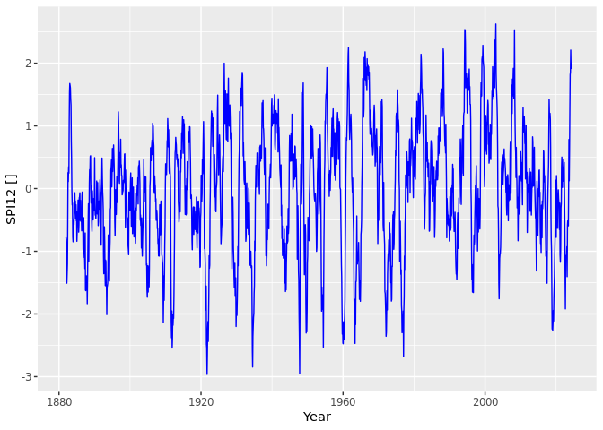

## DWD SPI

Use downloaded and converted precipitation data from DWD (monthly & regional summary)


```r
#install.packages("SCI")   # MAAS, Matrix, 
require("SCI")
```

```
## Loading required package: SCI
```

```
## Warning: package 'SCI' was built under R version 3.5.3
```

```
## Loading required package: fitdistrplus
```

```
## Warning: package 'fitdistrplus' was built under R version 3.5.3
```

```
## Loading required package: MASS
```

```
## Loading required package: survival
```

```
## Warning: package 'survival' was built under R version 3.5.3
```

```
## Loading required package: npsurv
```

```
## Warning: package 'npsurv' was built under R version 3.5.2
```

```
## Loading required package: lsei
```

```
## Warning: package 'lsei' was built under R version 3.5.2
```

```
## Loading required package: lmomco
```

```
## Warning: package 'lmomco' was built under R version 3.5.3
```

```r
prec <- read.csv("https://raw.githubusercontent.com/climdata/dwdPrecipitation/master/csv/monthly_precipitation_de.csv", sep=",")

prec <- prec[order(prec$ts),]
spi <-  data.frame(prec$year, prec$month)
names(spi)[names(spi) == "prec.year"] <- "year"
names(spi)[names(spi) == "prec.month"] <- "month"
spi$ts <- signif(spi$year + (spi$month-0.5)/12, digits=6)
spi$time <- paste(spi$year,spi$month, '15 00:00:00', sep='-')

start <- prec$month[1]
for (m in c(1,2,3,4,5,6,7,8,9,10,11,12)) {
  tmp.para <- fitSCI(prec$Deutschland, first.mon=start,distr="gamma",time.scale=m,p0=TRUE)
  tmp.spi <- transformSCI(prec$Deutschland,first.mon=start,obj=tmp.para)
  spi$new <- signif(tmp.spi, digits=6)
  names(spi)[names(spi) == "new"] <- paste("spi", m, sep="")
}

write.table(spi, file = "csv/spi_de.csv", append = FALSE, quote = TRUE, sep = ",",
            eol = "\n", na = "NA", dec = ".", row.names = FALSE,
            col.names = TRUE, qmethod = "escape", fileEncoding = "UTF-8")
```


## Plot Drought time line


```r
require("ggplot2")
```

```
## Loading required package: ggplot2
```

```
## Warning: package 'ggplot2' was built under R version 3.5.3
```

```r
#spi <- read.csv("./csv/spi_de.csv", sep=",")
mp <- ggplot() +
      geom_line(aes(y=spi$spi12, x=spi$ts), color="blue") +
      xlab("Year") + ylab("SPI12 []")
mp
```

```
## Warning: Removed 11 rows containing missing values (geom_path).
```

<!-- -->


