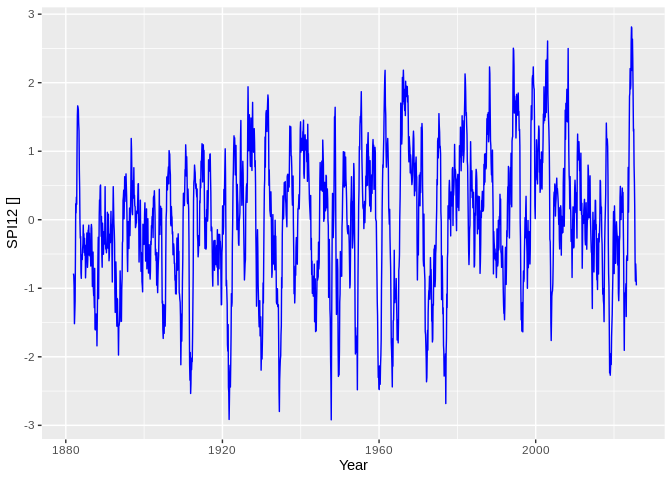

## DWD SPI

First download the precipitation data from dwd (monthly & regional summary)


```sh

for month in "01" "02" "03" "04" "05" "06" "07" "08" "09" "10" "11" "12"
do
 file="regional_averages_rr_$month.txt"
 echo "Download file: $file"
 [ -f ./download/$file ] && mv -f ./download/$file ./download/$file.bck
 wget -q -P download https://opendata.dwd.de/climate_environment/CDC/regional_averages_DE/monthly/precipitation/$file
 ## Remove first line !!
 tail -n +2 ./download/$file > ./download/$file.tmp && mv ./download/$file.tmp ./download/$file
done
```

```
## Download file: regional_averages_rr_01.txt
## Download file: regional_averages_rr_02.txt
## Download file: regional_averages_rr_03.txt
## Download file: regional_averages_rr_04.txt
## Download file: regional_averages_rr_05.txt
## Download file: regional_averages_rr_06.txt
## Download file: regional_averages_rr_07.txt
## Download file: regional_averages_rr_08.txt
## Download file: regional_averages_rr_09.txt
## Download file: regional_averages_rr_10.txt
## Download file: regional_averages_rr_11.txt
## Download file: regional_averages_rr_12.txt
```


```r
#install.packages("SCI")
require("SCI")
```

```
## Loading required package: SCI
```

```
## Warning: package 'SCI' was built under R version 3.5.3
```

```
## Loading required package: fitdistrplus
```

```
## Warning: package 'fitdistrplus' was built under R version 3.5.3
```

```
## Loading required package: MASS
```

```
## Loading required package: survival
```

```
## Loading required package: npsurv
```

```
## Warning: package 'npsurv' was built under R version 3.5.2
```

```
## Loading required package: lsei
```

```
## Warning: package 'lsei' was built under R version 3.5.2
```

```
## Loading required package: lmomco
```

```
## Warning: package 'lmomco' was built under R version 3.5.3
```

```r
prec <- read.csv("./download/regional_averages_rr_01.txt", sep=";")

for (month in c("02","03","04","05","06","07","08","09","10","11","12")){
  file <- paste("./download/regional_averages_rr_", month, ".txt", sep="")
  print(paste("Reading file:", file))
  tmp <- read.csv(file, sep=";")
  prec <- rbind(prec, tmp)
}
```

```
## [1] "Reading file: ./download/regional_averages_rr_02.txt"
## [1] "Reading file: ./download/regional_averages_rr_03.txt"
## [1] "Reading file: ./download/regional_averages_rr_04.txt"
## [1] "Reading file: ./download/regional_averages_rr_05.txt"
## [1] "Reading file: ./download/regional_averages_rr_06.txt"
## [1] "Reading file: ./download/regional_averages_rr_07.txt"
## [1] "Reading file: ./download/regional_averages_rr_08.txt"
## [1] "Reading file: ./download/regional_averages_rr_09.txt"
## [1] "Reading file: ./download/regional_averages_rr_10.txt"
## [1] "Reading file: ./download/regional_averages_rr_11.txt"
## [1] "Reading file: ./download/regional_averages_rr_12.txt"
```

```r
prec <- prec[order(prec$Jahr, prec$Monat),]
spi <-  data.frame(prec$Jahr, prec$Monat)
names(spi)[names(spi) == "prec.Jahr"] <- "year"
names(spi)[names(spi) == "prec.Monat"] <- "month"
spi$time <- signif(spi$year + (spi$month-1)/12, digits=6)

start <- prec$Monat[1]
for (m in c(1,2,3,4,5,6,7,8,9,10,11,12)) {
  tmp.para <- fitSCI(prec$Deutschland, first.mon=start,distr="gamma",time.scale=m,p0=TRUE)
  tmp.spi <- transformSCI(prec$Deutschland,first.mon=start,obj=tmp.para)
  spi$new <- signif(tmp.spi, digits=6)
  names(spi)[names(spi) == "new"] <- paste("spi", m, sep="")
}

write.table(spi, file = "csv/spi_de.csv", append = FALSE, quote = TRUE, sep = ",",
            eol = "\n", na = "NA", dec = ".", row.names = FALSE,
            col.names = TRUE, qmethod = "escape", fileEncoding = "UTF-8")
```


## Plot Drought time line


```r
 plot(spi$year,spi$spi12,t="l")
```

<!-- -->


